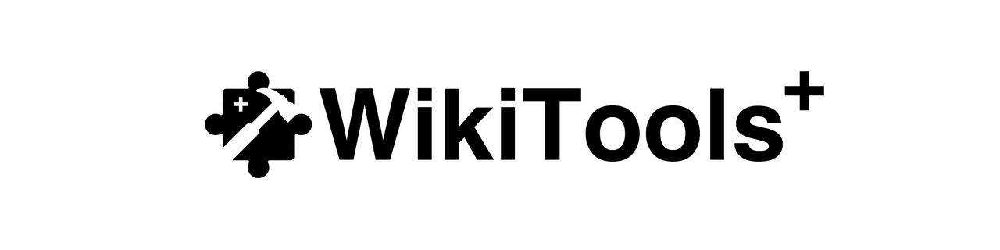

  <picture>
    <source media="(prefers-color-scheme: dark)" srcset="assets/banner-dark.png">
    
  </picture>

  
  
  
  

  <b>Personnalise tes cartes et simplifie la gestion de ta collection WikiMasters.</b>

## Fonctionnalités

- **Cadenas** : protège les cartes de ton choix contre les ventes et défausses accidentelles réalisées depuis ce navigateur.
- **Marché** : reste dans ta collection après une mise en vente, sans redirection automatique vers le marché.
- **Multi-étiquettes** : coche plusieurs étiquettes et applique-les à une même sélection de cartes.
- **Full Art** : personnalise les cartes de toutes les raretés, avec leur image d’origine ou une image importée. Ajuste le cadrage, le zoom, le halo et les effets visuels.
- **Raccourcis clavier** : utilise Entrée et les flèches pendant l’ouverture des boosters.
- **Cadrage et images** : importe une image, déplace-la horizontalement ou verticalement et ajuste son zoom de 100 à 250 %.
- **Halo et effets** : active ou désactive le halo de chaque carte, choisis sa couleur et règle les reflets, les scintillements ou l’inclinaison au survol.

Les fonctions peuvent être activées ou désactivées depuis le menu **WikiTools** du site.

## Installation sur Firefox

1. Ouvre la page des [releases](https://github.com/0xBricks/WikiTools/releases).
2. Dans la section **Assets** de la release, télécharge le fichier **`.xpi` signé**.
3. Dans Firefox, ouvre `about:addons`.
4. Clique sur la roue dentée, puis sur **Installer un module depuis un fichier…**.
5. Sélectionne le fichier `.xpi` et confirme l’installation.
6. Ouvre ou recharge [WikiMasters](https://www.wiki-masters.com/).

Il n’est pas nécessaire de décompresser le XPI ou d’activer un mode développeur. Cette version est destinée à Firefox ; aucune version Chrome n’est proposée ici.

## Utilisation

Ouvre le menu **WikiTools**, affiché sur le site. Chaque catégorie possède son interrupteur : **Cadenas**, **Marché**, **Multi-étiquettes**, **Raccourcis clavier** et **Apparence des cartes**. Tes choix sont enregistrés automatiquement.

### Protéger des cartes avec les cadenas

Dans ta collection, utilise la sélection habituelle du site pour choisir une ou plusieurs cartes, puis clique sur **Verrouiller**. Un cadenas indique les cartes protégées ; leurs actions de vente et de défausse sont bloquées dans ce navigateur tant que la fonction est active.

Pour retirer la protection, sélectionne les cartes verrouillées puis clique sur **Déverrouiller**. Si ta sélection mélange des cartes verrouillées et non verrouillées, le bouton permet de toutes les verrouiller.

### Rester dans la collection après une mise en vente

Active **Marché** puis mets une carte en vente normalement depuis la collection. L’extension empêche la redirection automatique vers le marché pour te laisser continuer à gérer tes cartes. Tu peux toujours ouvrir le marché volontairement avec les liens du site.

### Appliquer plusieurs étiquettes

Active **Multi-étiquettes**, sélectionne les cartes dans ta collection et ouvre le menu d’étiquettes du site. Coche les étiquettes souhaitées, puis clique sur le bouton d’application. L’extension les applique successivement à ta sélection : attends la fin du traitement avant de poursuivre. Si une opération échoue, un message indique combien d’étiquettes ont déjà été appliquées.

### Personnaliser l’apparence d’une carte

Active **Apparence des cartes**, clique sur **Personnaliser une carte**, puis directement sur une carte dans la collection ou la vitrine. Les réglages de cette carte s’affichent dans le panneau, quelle que soit sa rareté.

- **Full Art** : active cet interrupteur pour étendre l’image sur toute la carte.
- **Image** : conserve l’image d’origine ou clique sur **Choisir une image…** pour importer la tienne. Active le Full Art pour afficher l’image importée. Les fichiers sont limités à 8 Mo, optimisés à 1 200 pixels et les images animées deviennent fixes. Le bouton de retour à l’image d’origine permet de retirer l’image personnalisée.
- **Cadrage** : ajuste les curseurs **Horizontal**, **Vertical** et **Zoom** avec un aperçu directement sur la carte en Full Art. Ces réglages fonctionnent avec l’image d’origine comme avec une image importée. **Réinitialiser le cadrage** restaure le cadrage par défaut.
- **Halo** : active ou désactive la lueur de cette carte et choisis sa couleur. **Halo automatique** rétablit la couleur calculée automatiquement.
- **Effets communs à toutes les cartes** : choisis la brillance du site uniquement, un reflet holographique arc-en-ciel, un reflet doré ou des scintillements. Ajuste leur intensité et active ou désactive l’inclinaison légère au survol. Ces réglages sont communs, contrairement au cadrage et au halo propres à chaque carte.

Les réglages sont enregistrés automatiquement. Sélectionne une autre carte pour la personnaliser à son tour. Désactiver **Apparence des cartes** masque les personnalisations sans les supprimer.

### Ouvrir les boosters au clavier

Active **Raccourcis clavier**, puis rends-toi sur la page d’ouverture des boosters. Les touches suivent les actions disponibles à l’écran :

| Touche | Action |
|---|---|
| Entrée | Activer le bouton d’ouverture ou de continuation disponible |
| Flèche gauche / droite | Utiliser la navigation disponible entre les cartes |

Les raccourcis peuvent être désactivés dans le menu. Il n’y a pas de raccourci clavier dédié aux cadenas.

## Sauvegarde et limites

Les cadenas, les réglages et les images importées sont enregistrés localement dans le profil Firefox. Ils restent disponibles après la fermeture du navigateur, mais ne sont pas synchronisés entre appareils. La suppression des données de l’extension ou sa désinstallation peut les effacer.

Les images importées sont traitées sur ton appareil et ne sont pas envoyées à un serveur par l’extension. Les personnalisations Full Art sont visibles dans ton navigateur.

Les cadenas sont une protection locale : ils ne verrouillent pas les cartes sur ton compte depuis un autre navigateur ou appareil. Une évolution du site, de ses sélecteurs ou de ses composants internes peut perturber certaines fonctions.

## Mises à jour

L’extension est configurée pour rechercher ses mises à jour via les releases GitHub. Pour qu’une nouvelle version soit proposée automatiquement, sa release doit fournir le XPI signé et un fichier `updates.json` à jour. Publier uniquement des modifications du code source ne met pas à jour les extensions installées.

## Open source et contributions

**WikiTools est open source : tu peux consulter le code, le modifier et créer ta propre version.** Tu peux aussi le redistribuer dans le respect de la licence [Apache 2.0](LICENSE), notamment en conservant la licence et les mentions requises et en signalant tes modifications.

Une idée de fonctionnalité, une correction ou une amélioration ? Les contributions sont les bienvenues : crée un **fork** du dépôt, apporte tes changements et propose une **pull request** pour les partager avec le projet.

Le dossier [`src`](src) contient le code de l’extension. Pour l’utiliser normalement, installe le XPI signé depuis les releases.

Pour signaler un bug ou proposer une amélioration, ouvre une [issue](https://github.com/0xBricks/WikiTools/issues) en indiquant ta version de Firefox, celle de WikiTools et les étapes permettant de reproduire le problème.

## Licence

Le code est distribué sous licence **Apache 2.0**. Consulte le fichier [LICENSE](LICENSE).

WikiTools est un projet communautaire non officiel, non affilié à WikiMasters.
